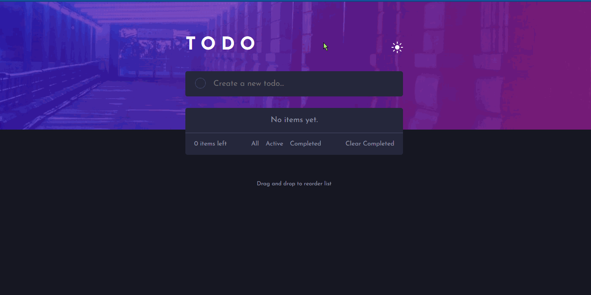

# Frontend Mentor - Todo app solution

This is a solution to the [Todo app challenge on Frontend Mentor](https://www.frontendmentor.io/challenges/todo-app-Su1_KokOW). Frontend Mentor challenges help you improve your coding skills by building realistic projects. 

Preview site [here](https://warm-hollows-18751.herokuapp.com/).

## Table of contents

- [Overview](#overview)
  - [The challenge](#the-challenge)
  - [Solution Walkthrough]()
  - [Screenshot](#screenshot)
  - [Links](#links)
- [My process](#my-process)
  - [Built with](#built-with)
  - [Useful resources](#useful-resources)
- [Author](#author)

## Overview

### The challenge

Users should be able to:

- View the optimal layout for the app depending on their device's screen size
- See hover states for all interactive elements on the page
- Add new todos to the list
- Mark todos as complete
- Delete todos from the list
- Filter by all/active/complete todos
- Clear all completed todos
- Toggle light and dark mode
- Drag and drop to reorder items on the list
- Uncheck complete todos
- Use the current mode(light/dark) on their device

### Solution Walkthrough

### Screenshot
#### Desktop

#### Mobile

### Links

- Solution URL: [My solution](https://www.frontendmentor.io/solutions/todo-app-9sc_uIoHm)
- Live Site URL: [Live site](https://warm-hollows-18751.herokuapp.com/)

## My process

### Built with

- Semantic HTML5 markup
- CSS custom properties
- Flexbox
- Sass
- [Express.js](https://expressjs.com/) - Node.js Web framework
- [Ejs](https://ejs.co/) - Embedded JS Template
- [Mongoose](https://mongoosejs.com/) - MongoDB object modeling for Node.js

### Useful resources

- [W3Schools](https://www.w3schools.com/) 
- [jQuery Sortable](https://jqueryui.com/sortable/)
- [Stack Overflow](https://stackoverflow.com/)

## Author

- Frontend Mentor - [@Josh-Ay](https://www.frontendmentor.io/profile/Josh-Ay)
